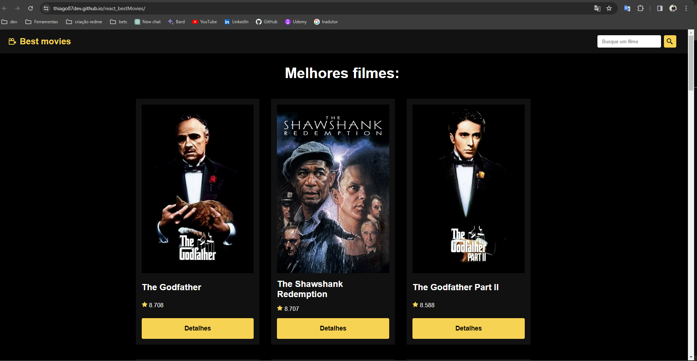

# Best Movies 🎦
## React + Vite

### 💡 Functionalities 

* API Consumption - TMDb API (The Movie Database)
* The home page shows the 20 highest rated films on the TMDB website
* Enter a movie name (in English) and get top 20 rated results
* You can see the movie details by clicking the 'detalhes' button
* Response

###  🛠️ Built with

* React
* Vite
* Git/GitHub

### 🌐 Website
:link: Link to access the website: 
https://thiago87dev.github.io/react_bestMovies/

### 📸 Screenshots

### Layout Desktop

### Layout Mobile

### ✒️ Author
## :raising_hand: Thiago Alves

- Linkedin - [Thiago Alves](https://www.linkedin.com/in/thiago-alves-010915274/)
- GitHub - [Thiago87dev](https://github.com/Thiago87dev)
- Frontend Mentor - [@MrThiago87](https://www.frontendmentor.io/profile/MrThiago87)
- Instagram - [@thiagopaulista87](https://www.instagram.com/thiagopaulista87/)
